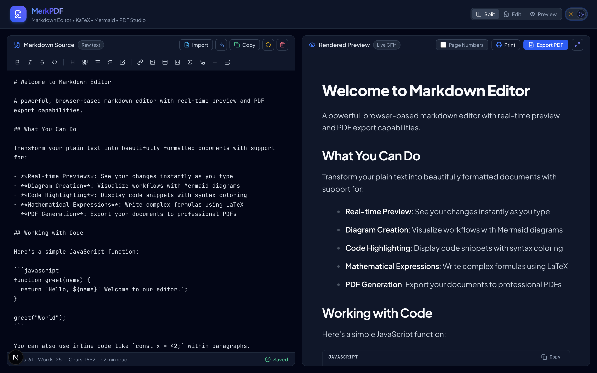

# MerkPDF — Modern Markdown Editor & PDF Exporter

A fast, elegant, and distraction-free Markdown editor built with Next.js, React, and Tailwind CSS. Write in Markdown with live preview and instantly export pixel-perfect PDFs with support for tables, code syntax highlighting, KaTeX math formulas, and Mermaid diagrams.



## Features

- **Live Split-Pane Preview**: Write markdown on the left and see clean, styled output on the right in real time.
- **Rich Markdown Support**:
  - GitHub Flavored Markdown (tables, task lists, strikethrough, autolinks)
  - Code syntax highlighting with auto-detected languages
  - KaTeX LaTeX math rendering for inline and block equations
  - Mermaid diagram rendering (flowcharts, sequence diagrams, state machines, etc.)
- **One-Click PDF Export**: High-fidelity PDF generation with custom page margin and layout handling.
- **Theme Support**: Clean modern dark and light modes.
- **Privacy First**: Everything runs client-side in your browser. No documents are uploaded or stored on external servers.

## Tech Stack

- **Framework**: [Next.js](https://nextjs.org/) (App Router)
- **Styling**: [Tailwind CSS](https://tailwindcss.com/)
- **Markdown & Math**: `react-markdown`, `remark-gfm`, `remark-math`, `rehype-katex`, `rehype-highlight`
- **Diagrams**: [Mermaid](https://mermaid.js.org/)
- **Icons**: [Lucide React](https://lucide.dev/) & [React Icons](https://react-icons.github.io/react-icons/)
- **PDF Engine**: Client-side rendering pipeline (`html2pdf.js` / `@react-pdf/renderer`)

## Getting Started

### Prerequisites

- Node.js 18.x or later
- npm, yarn, pnpm, or bun

### Installation

```bash
git clone https://github.com/tanyas27/merk-pdf.git
cd merk-pdf
npm install
```

### Running Locally

```bash
npm run dev
```

Open [http://localhost:3000](http://localhost:3000) in your browser.

### Building for Production

```bash
npm run build
npm run start
```

## License

MIT
